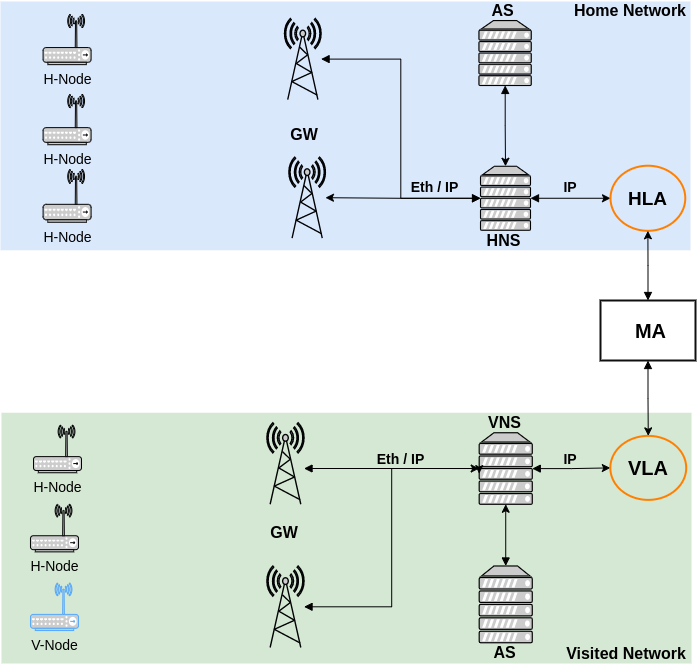
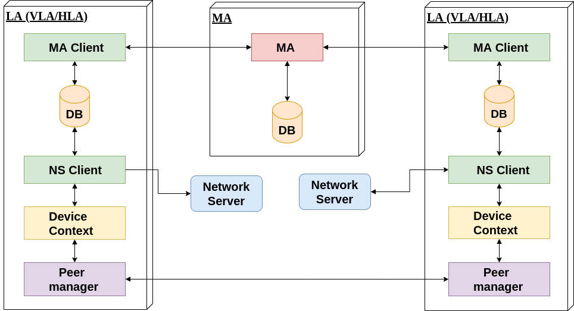
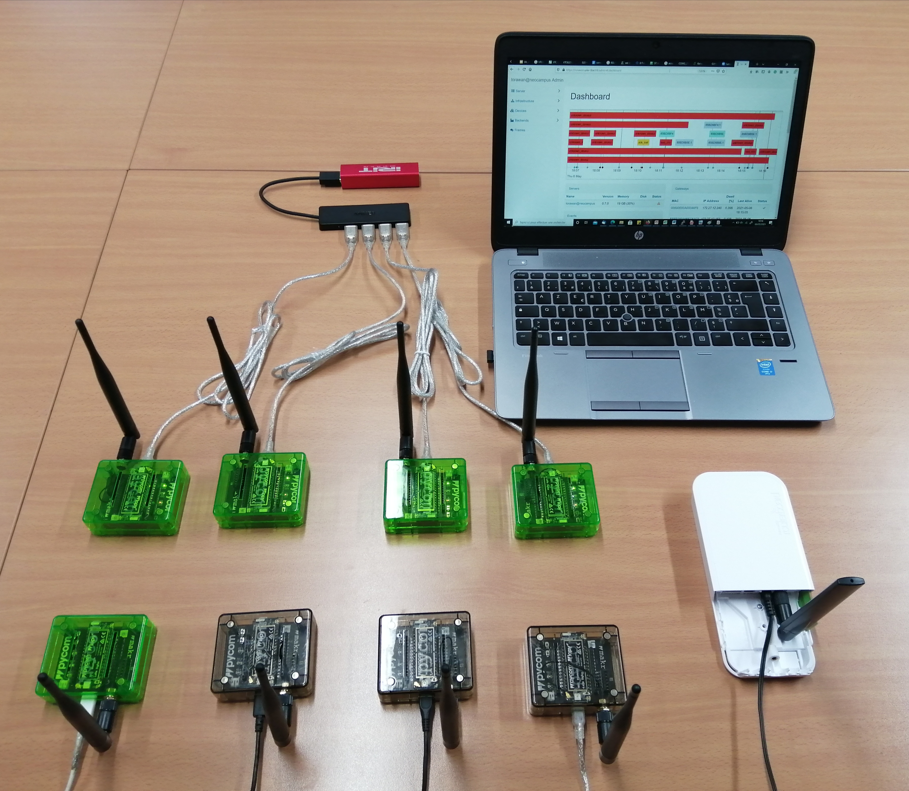

# LoRaWAN Handover Roaming 
LoRaWAN Handover Roaming is novel LoRaWAN roaming scheme to enable inter-operatorroaming based on DNS resolution and end-device context migration between networks. In this work, Our contributions are threefold :

* Design and implementation of a LoRaWAN architecture extension to handle inter-operators roaming capability.
* End-devices lookup DNS-based resolution using JoinEUI codification.
* Real Deployment roaming testbed

# LoRaWAN Architecture Extension
We extended the LoRaWAN standard architedture with two main components as illustrated in the following figure.

* MA
* LA

<p align="center">

</p>

<p align="center">

</p>


# Experimental Hardware

<p align="center">

</p>


# Citation
```
@INPROCEEDINGS{9524996,
  author={Hamnache, Mohamed and Kacimi, Rahim and Beylot, André-Luc},
  booktitle={2021 IEEE 46th Conference on Local Computer Networks (LCN)}, 
  title={Unifying LoRaWAN Networks by Enabling the Roaming Capability}, 
  year={2021},
  volume={},
  number={},
  pages={371-374},
  doi={10.1109/LCN52139.2021.9524996}}
```

